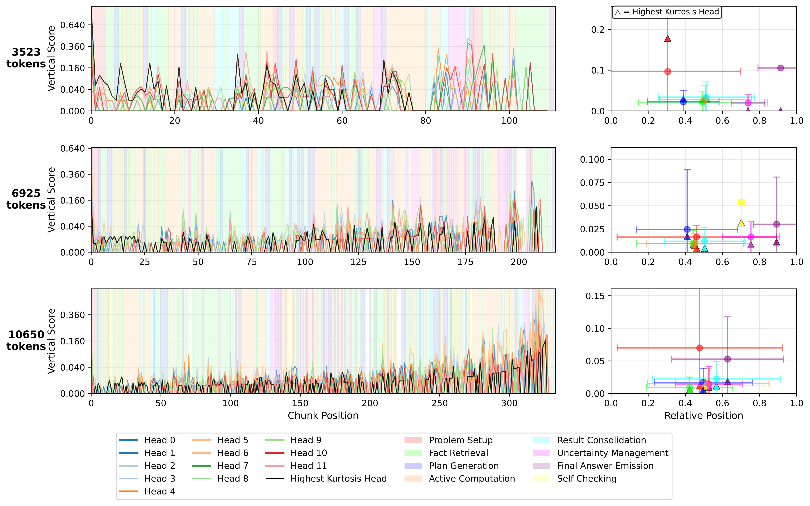

# Research

## 2025

    

        
    

    

        <h3 class="publication-title">
            <a href="PDFs/Aiding Communication in Aphasia Patients .pdf" class="publication-link">
                Aiding Communication in Aphasia Patients with Aritifical Intelligence
            </a>
        </h3>
        
MSc Dissertation

        
University of Nottingham

        
 Adapt a pre-trained natural language model to repair errors in fragmented speech 

        
SUMMER 2025

        

            NLP
              Python
            <a href="PDFs/Aiding Communication in Aphasia Patients .pdf" class="tag tag-arxiv">PDF</a>
            <!-- <a href="https://github.com/jrosseruk/infusion" class="tag tag-github">GITHUB</a> -->
        

    

## 2025

    

        
    

    

        <h3 class="publication-title">
            <a href="/AgentBreeder" class="publication-link">
                AgentBreeder: Mitigating the AI Safety Impact of Multi-Agent Scaffolds via Self-Improvement
            </a>
        </h3>
        
NeurIPS 2025 spotlight

        
J Rosser, Jakob Foerster

        
2025

        

            Multi-Agent Safety
            <a href="https://arxiv.org/abs/2502.00757" class="tag tag-arxiv">ARXIV</a>
            <a href="https://github.com/J-Rosser-UK/AgentBreeder" class="tag tag-github">GITHUB</a>
        

    

    

        
    

    

        <h3 class="publication-title">
            <a href="https://arxiv.org/pdf/2510.19875" class="publication-link">
                Stream: Scaling Mechanistic Interpretability to Long Context in LLMs via Sparse Attention
            </a>
        </h3>
        
NeurIPS 2025 Mech Interp Workshop

        
J Rosser, José Luis Redondo García, Gustavo Penha, Konstantina Palla, Hugues Bouchard

        
2025

        

            Mechanistic Interpretability
            <a href="https://arxiv.org/pdf/2510.19875" class="tag tag-arxiv">ARXIV</a>
        

    

