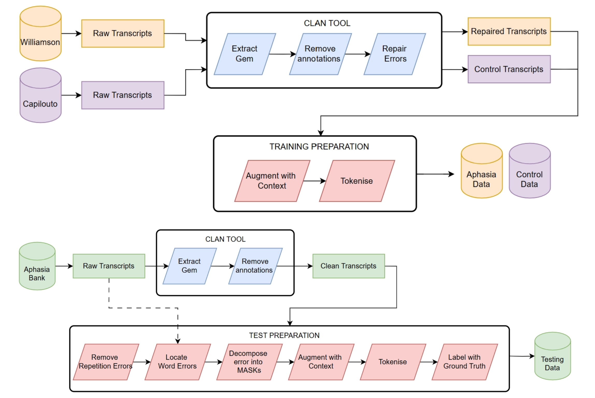
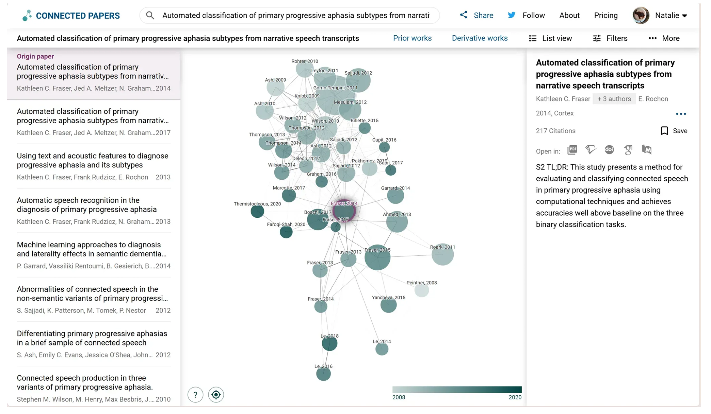
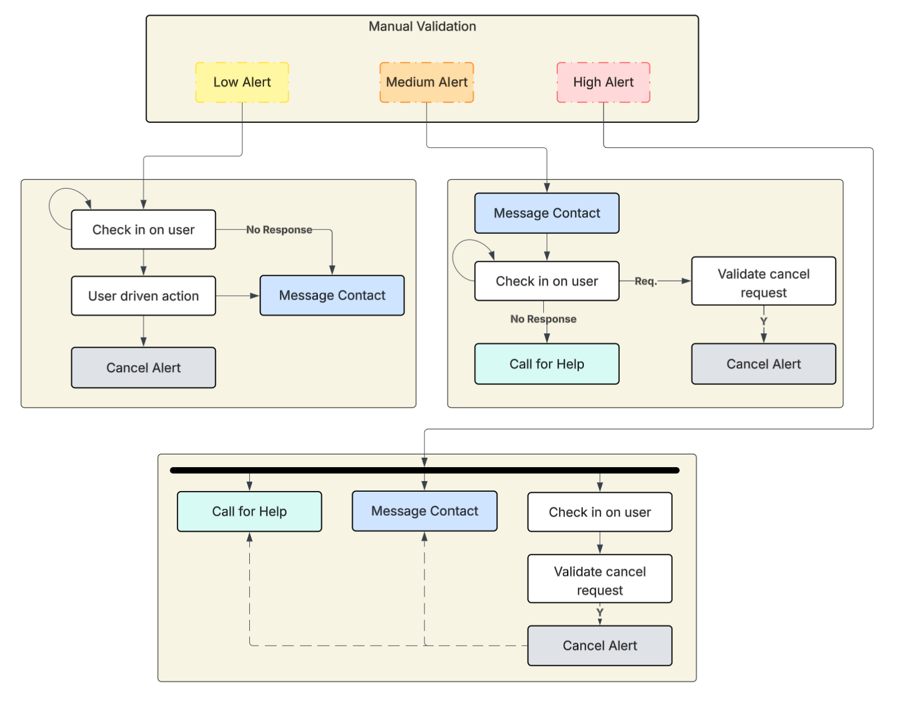
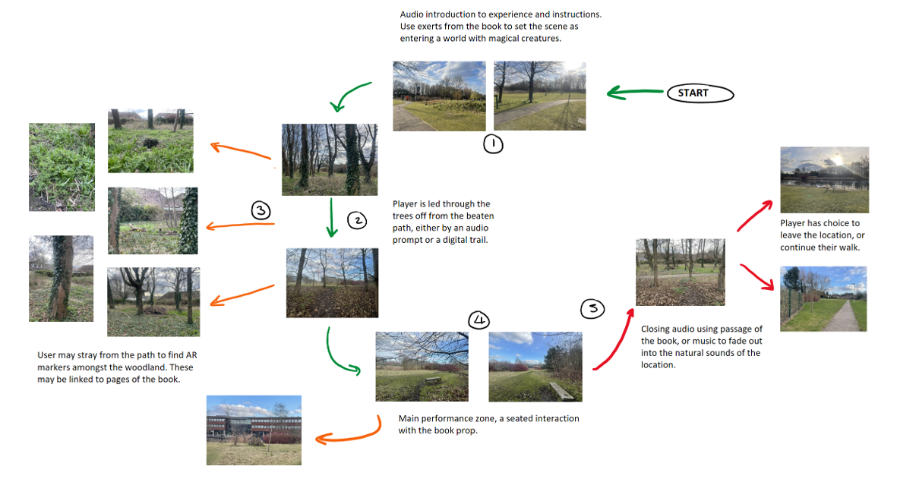
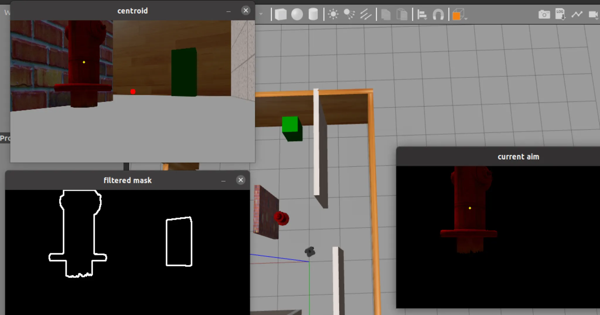

# Research

## 2025

    

        
    

    

        <h3 class="publication-title">
            <a href="PDFs/Aiding Communication in Aphasia Patients .pdf" class="publication-link">
                Aiding Communication in Aphasia Patients with Aritifical Intelligence
            </a>
        </h3>
        
MSc Dissertation

        
University of Nottingham

        
 The pre-trained language model BERT uses surrounding sentence context to predict masked words. This study explores the adaption of BERT to analyse fragmented speech produced by people with aphaisa or similar language disorders, aiming to automate the repair of word-finding and production errors. Focus is placed on determining the contextual domain necessary to fine-tune an accurate model on these unique speech patterns, as well as the optimal size of the neighbouring context window. To validate predictions against human interpretation, the AphasiaBank database provides annotated transcriptions with suggested ground-truth values.
        

        
SUMMER 2025

        

            NLP
              Python
            <a href="PDFs/Aiding Communication in Aphasia Patients .pdf" class="tag tag-pdf">PDF</a>
            <!-- <a href="https://github.com/jrosseruk/infusion" class="tag tag-github">GITHUB</a> -->
        

    

    

        
    

    

        <h3 class="publication-title">
            <a href="PDFs/Research_Methods_CW3.pdf" class="publication-link">
                Abridged Review of Multimodal Artificial Intelligence within the Understanding of Aphasia Speech
            </a>
        </h3>
        
COMP4037 Research Methods

        
University of Nottingham

          
 Literature review exploring the creation of intelligent speech aids used to support the rehabilitation and social reintegration of prople who have experienced aphasia after a stroke event. 
     

        
SUMMER 2025

       

            NLP
           Sensors
            <a href="PDFs/Research_Methods_CW3.pdf" class="tag tag-pdf">PDF</a>
            <!-- <a href="https://github.com/jrosseruk/infusion" class="tag tag-github">GITHUB</a> -->
        

    

    

        
    

    

        <h3 class="publication-title">
            <a href="PDFs/Designing_Sensor_Based_Systems.pdf" class="publication-link">
                Passive Monitoring of Fall-Events using Vibrations
            </a>
        </h3>
        
COMP4104 Designing Sensor-Based Systems

        
University of Nottingham

        
 A prototype of a floor-mounted sensing system to alert in the event of a fall or large collision. This uses ubiqitous computing methods to reduce intrusion and collection of unecessary data. 

        
SPRING 2025

       

            HCI
           Sensors
            Python
            Rasberry Pi
            <a href="PDFs/Designing_Sensor_Based_Systems.pdf" class="tag tag-pdf">PDF</a>
            <!-- <a href="https://github.com/jrosseruk/infusion" class="tag tag-github">GITHUB</a> -->
        

    

    

        
    

    

        <h3 class="publication-title">
            <a href="PDFs/LitReview_Sensor_Based_Systems.pdf" class="publication-link">
                The Use of Voice Interfaces as an Accessible Aid within Unicomp Visions
            </a>
        </h3>
        
COMP4104 Designing Sensor-Based Systems

        
University of Nottingham

        
 An abridged literature review on recognition technologies and the presence within founding visions on ubiquitous computing. 

        
SPRING 2025

       

            HCI
           Sensors
            <a href="PDFs/LitReview_Sensor_Based_Systems.pdf" class="tag tag-pdf">PDF</a>
            <!-- <a href="https://github.com/jrosseruk/infusion" class="tag tag-github">GITHUB</a> -->
        

    

    

        
    

    

        <h3 class="publication-title">
            <a href="" class="">
                A Mixed Reality Experience - Exploiting the Characteristics of a Location to Increase AR Immersion
            </a>
        </h3>
        
COMP4036 Mixed Reality

        
University of Nottingham

        
 A mixed-reality performance designed to engage users within a particular setting. This makes use of the university's 'artcodes', which brings QR code functionality without impacting immersion. This uses Augmented Reality to enhance a non-fiction style storybook by creating a window into the fantasy world the author has created. This project focuses on the challenges present when exploring mixed reality, and the ideation process of a large-scale project. Video presentation and demo of prototype. 

        
SPRING 2025

       

            HCI
           Computer Vision
             AR
           JavaScript
           <!-- <a href="PDFs/Aiding Communication in Aphasia Patients .pdf" class="tag tag-pdf">PDF</a> -->
            <!-- <a href="https://github.com/jrosseruk/infusion" class="tag tag-github">GITHUB</a> -->
        

    

 <!--
 

    

        
    

    

        <h3 class="publication-title">
            <a href="/AgentBreeder" class="publication-link">
                ML
            </a>
        </h3>
        
COMP4139 Machine Learning

        
University of Nottingham

        
group project to strengthen ml concepts - ML detection of breast cancer cells based on data from scans  

        
AUTUMN 2024

       

            ML
           Python
             MATLAB
           JavaScript
            <!-- <a href="https://github.com/jrosseruk/infusion" class="tag tag-github">GITHUB</a> -->
        

    

<!--
 
-->

## 2024

    

        
    

    

        <h3 class="publication-title">
            <a href="PDFs/Networks_Project.pdf" class="publication-link">
                Investigating Protocol Performance within Smart Oceans and their Created Mobile Networks
            </a>
        </h3>
        
COMP4032 Advanced Computer Networks

        
University of Nottingham

        
 This project evaluates the performance and scalability of single-copy routing protocols against a flooding-based approach in an opportunistic network. This is set within a simulated 'smart ocean' driven by marine wildlife tracking, tagged animals act as sensor nodes to relay data from those that do not travel within satellite range. As this acts as a Delay-Tolerant Network, efficient delivery is critical to overcome the high resource costs of underwater communications.
            

        
AUTUMN 2024

       

            ONE Simulator
           Java
            <a href="PDFs/Networks_Project.pdf" class="tag tag-pdf">PDF</a>
            <!-- <a href="https://github.com/jrosseruk/infusion" class="tag tag-github">GITHUB</a> -->
        

    

    

        
    

    

        <h3 class="publication-title">
            <a href="PDFs/Robotics_Report.pdf" class="publication-link">
                Autonomous Robotic Systems Finding Objects in a Scene 
            </a>
        </h3>
        
COMP4034 Autonomous Robotic Systems

        
University of Nottingham

        
 The navigation a turtlebot through both real and simulated Gazebo environments, aiming to detect and visit coloured objects using image processing and localisation techniques.   
        

        
AUTUMN 2024 

       

            Robotics
           Computer Vision
             Sensors
           Python
           ROS
           RViz
            <a href="PDFs/Robotics_Report.pdf" class="tag tag-pdf">PDF</a>
            <!-- <a href="https://github.com/jrosseruk/infusion" class="tag tag-github">GITHUB</a> -->
        

    

    

        
    

    

        <h3 class="publication-title">
            <a href="" class="publication-link">
                Building a Low-Polygon Diorama Library in Three.js with a focus on NPC movement and interaction
            </a>
        </h3>
        
BSc Dissertation

        
University of Warwick

        
 An extension for the three.js library introducing pre-built NPCs. These animated characters have random movement with collision avoidance, and can be placed inside a customisable modular-world. This creates a fully working, easy-to-use prototype of a 3D scene editor. 
        

        
SUMMER 2024 

       

            Computer Graphics
           HCI
           JavaScript
            <a href="" class="tag tag-pdf">PDF</a>
            <!-- <a href="https://github.com/jrosseruk/infusion" class="tag tag-github">GITHUB</a> -->
        

    

